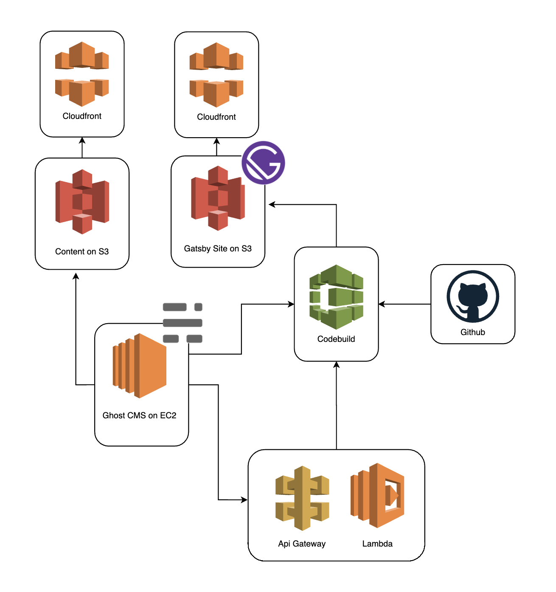

# Gatsby Ghost AWS Blog Stack

This project creates the infrastructure of an end to end solution for a self hosted blog. After setting this up, a user will have a serverside rendered blog built with React, a passward protected CMS with GUI for content creation, and continuous delivery pipeline that deploys the updated content on creation and/or edit.

- Frontend - [Gatsby](https://www.gatsbyjs.org/starters/TryGhost/gatsby-starter-ghost/)
- CMS - [Ghost](https://ghost.org/docs/setup/)
- Hosting - AWS [EC2](https://aws.amazon.com/ec2/), [S3](https://aws.amazon.com/s3/) and [Cloudfront](https://aws.amazon.com/cloudfront/)
- CI/CD - AWS [Codebuild](https://aws.amazon.com/codebuild/) and [Lambda](https://aws.amazon.com/lambda/)
- Infrastructure as Code - AWS [Cloudformation](https://aws.amazon.com/cloudformation/) and [Secrets Manager](https://aws.amazon.com/secrets-manager/)


## Architecture


## Setup

#### .env

Create a file name  _.env_ in the root of the project and add these variables with updated values:

```
ENV=update
PROJECT_NAME=update
SSH_KEY_NAME=update
GITHUB_TOKEN=update
GITHUB_REPO_URL=update
AWS_PROFILE=update
```

#### Initial Steps

Run these commands locally to get AWS resources configured:

1. `make create-buckets`
1. `make install-build`
1. `make package-function`
1. `make upload-function`
1. `make create-roles`
1. `make create-service`
1. `make create-build`

* If you have use codebuild with github before, you  will likely get an error about the SourceCredential already being defined for type GITHUB. Simply Remove the SourceCredential and the ref to it in th Codebuild, delete the failed stack in Cloudformation, and run `make create-build` again.

### Ghost

#### Server Setup

Get the ec2 instance Public DNS (IPv4) Address via the aws console. It looks something like this: `ec2-55-55-55-555.compute-1.amazonaws.com`

ssh into the ec2 instance:
```
ssh -i "~/path/to/file.pem" ubuntu@<EC2 Public DNS Address>
```
Now follow these instructions: https://ghost.org/docs/install/ubuntu/

#### S3 Setup

As well, install the s3 plugin and configure it: https://github.com/colinmeinke/ghost-storage-adapter-s3. You will need the AWS access keys for the Content User (found in the IAM section of  the AWS console). As well you need the Content bucket name, "${ProjectName}-content-${env}", and the cloudfront url to add as the assetHost.

```
"storage": {
  "active": "s3",
  "s3": {
    "accessKeyId": "CONTENT_USER_ACCESS_KEY_ID",
    "secretAccessKey": "CONTENT_USER_SECRET_ACCESS_KEY",
    "region": "us-east-1",
    "bucket": "CONTENT_BUCKET_NAME",
    "assetHost": "CONTENT_CDN_URL" # remember to add the https://
  }
}
```

#### Link Gatsby to Ghost Content API

Create an Integration in the Ghost admin UI and name it "Build". Copy the `Content API Key` which will be populated in the Integration Modal. Back in this project code add it to the file  _frontend/.ghost.json_. Push your changes up to github (and merge to master).

To this integration, add a custom webhook of this format: `{api-gateway-url}/{env}/build`.

> This webhook will trigger a build when the content changes in the Ghost CMS. This is accomplished via API Gateway backed by a Lambda that will trigger a build and deploy process via Codebuild.

### Codebuild setup

In the AWS console navigate to the recently created Codebuild project and ensure that your frontend github repo is successfully linked. To verfiy, navigate to Edit the Source of the Codebuild project and ensure the it reads "Connection status: You are connected to GitHub using a personal access token..

Now locally, kick of a new build:
```sh
$ make start-build
```

Navigate back to the Codebuild UI and confirm that a new build is in progress a new build is in progress. If successful, your frontend will be added to the Site s3 bucket and available at the Cloudfront endpoint.

> Remember: merging to master or saving content on the Ghost admin UI will also kick off a build.

### Todo:
- diagram
- add scheduled ec2 backups to cloudformation

